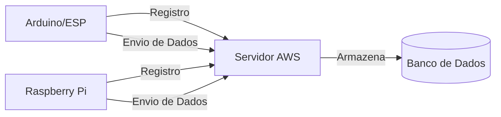

# Documentação Técnica - Implementação dos Sensores

## Visão Geral
Este documento descreve a implementação necessária para a comunicação dos sensores (Arduino/ESP ou Raspberry Pi) com o servidor web do sistema Sensorium.

### Objetivo
Estabelecer comunicação entre os dispositivos de monitoramento (Arduino/ESP ou Raspberry Pi) e o servidor web hospedado na AWS, enviando dados de pH e nível de água das cisternas.

### Arquitetura do Sistema


## Registro do Dispositivo

Antes de enviar dados, cada dispositivo deve se registrar no sistema. Este processo é automático e gera um ID único para o dispositivo.

### Endpoint de Registro
- URL: `https://seu-dominio-aws.com/api/dispositivo/registro`
- Método: `POST`
- Content-Type: `application/json`

### Formato dos Dados de Registro
```json
{
    "dispositivo_id": "ARDUINO_001",    // ID único gerado pelo dispositivo
    "tipo_equipamento": "arduino"       // "arduino" ou "raspberry"
}
```

### Respostas do Registro
- Sucesso (200):
```json
{
    "success": true,
    "message": "Dispositivo registrado com sucesso"
}
```

- Erro (400, 409):
```json
{
    "error": "Mensagem de erro específica"
}
```

## Especificações da API de Dados

### Endpoint de Dados
- URL: `https://seu-dominio-aws.com/api/sensor/dados`
- Método: `POST`
- Content-Type: `application/json`

### Formato dos Dados
```json
{
    "dispositivo_id": "ARDUINO_001",  // ID único do dispositivo registrado
    "tipo": "ph",                     // Tipo de leitura: "ph" ou "nivel"
    "valor": 7.2,                     // Valor numérico da leitura
    "status": "ALTO"                  // Apenas para tipo "nivel": "ALTO" ou "BAIXO"
}
```

### Exemplos de Requisição

1. Envio de dados de pH:
```json
{
    "dispositivo_id": "ARDUINO_001",
    "tipo": "ph",
    "valor": 7.2
}
```

2. Envio de dados de nível:
```json
{
    "dispositivo_id": "ARDUINO_001",
    "tipo": "nivel",
    "valor": 1,
    "status": "ALTO"
}
```

### Respostas da API
- Sucesso (200):
```json
{
    "success": true,
    "message": "Dados registrados com sucesso"
}
```

- Erro (400, 404, 500):
```json
{
    "error": "Mensagem de erro específica"
}
```

## Implementação Arduino/ESP

### Requisitos de Hardware
- ESP8266 ou ESP32 (com WiFi)
- Sensor de pH (analógico)
- Sensor de nível de água (digital)
- Fonte de alimentação estável

### Bibliotecas Necessárias
```cpp
#include <ESP8266WiFi.h>  // Para ESP8266
// ou #include <WiFi.h>    // Para ESP32
#include <HTTPClient.h>
#include <ArduinoJson.h>
```

### Código de Implementação

```cpp
#include <ESP8266WiFi.h>
#include <HTTPClient.h>
#include <ArduinoJson.h>
#include <EEPROM.h>

// Configurações de WiFi
const char* ssid = "SUA_REDE_WIFI";
const char* password = "SENHA_DO_WIFI";

// URLs do servidor
const char* registroUrl = "https://seu-dominio-aws.com/api/dispositivo/registro";
const char* dadosUrl = "https://seu-dominio-aws.com/api/sensor/dados";

// Identificador único do dispositivo (será gerado na primeira execução)
String dispositivo_id = "";

// Pinos dos sensores
const int pinoSensorPH = A0;
const int pinoSensorNivel = 2;

void setup() {
  Serial.begin(115200);
  EEPROM.begin(512);
  
  // Conectar ao WiFi
  WiFi.begin(ssid, password);
  while (WiFi.status() != WL_CONNECTED) {
    delay(500);
    Serial.print(".");
  }
  Serial.println("\nConectado ao WiFi!");
  
  // Verificar se já tem um ID registrado
  dispositivo_id = lerDispositivoId();
  if (dispositivo_id == "") {
    // Gerar e registrar novo ID
    dispositivo_id = gerarDispositivoId();
    if (registrarDispositivo()) {
      salvarDispositivoId(dispositivo_id);
    }
  }
}

void loop() {
  if (WiFi.status() == WL_CONNECTED && dispositivo_id != "") {
    // Ler dados dos sensores
    float valorPH = lerSensorPH();
    int nivelAgua = lerSensorNivel();
    String statusNivel = nivelAgua ? "ALTO" : "BAIXO";
    
    // Enviar dados de pH
    enviarDados("ph", valorPH, "");
    delay(1000);
    
    // Enviar dados de nível
    enviarDados("nivel", nivelAgua, statusNivel);
    
    delay(300000); // 5 minutos entre leituras
  }
}

String gerarDispositivoId() {
  // Gerar ID único baseado no MAC address
  String mac = WiFi.macAddress();
  mac.replace(":", "");
  return "ARDUINO_" + mac.substring(6);
}

bool registrarDispositivo() {
  HTTPClient http;
  
  StaticJsonDocument<200> doc;
  doc["dispositivo_id"] = dispositivo_id;
  doc["tipo_equipamento"] = "arduino";
  
  String jsonString;
  serializeJson(doc, jsonString);
  
  http.begin(registroUrl);
  http.addHeader("Content-Type", "application/json");
  
  int httpResponseCode = http.POST(jsonString);
  bool sucesso = (httpResponseCode == 200);
  
  http.end();
  return sucesso;
}

void enviarDados(String tipo, float valor, String status) {
  HTTPClient http;
  
  StaticJsonDocument<200> doc;
  doc["dispositivo_id"] = dispositivo_id;
  doc["tipo"] = tipo;
  doc["valor"] = valor;
  if (status != "") {
    doc["status"] = status;
  }
  
  String jsonString;
  serializeJson(doc, jsonString);
  
  http.begin(dadosUrl);
  http.addHeader("Content-Type", "application/json");
  
  int httpResponseCode = http.POST(jsonString);
  
  if (httpResponseCode > 0) {
    String response = http.getString();
    Serial.println("Resposta: " + response);
  } else {
    Serial.println("Erro no envio: " + String(httpResponseCode));
  }
  
  http.end();
}

String lerDispositivoId() {
  String id = "";
  for (int i = 0; i < 20; i++) {
    char c = EEPROM.read(i);
    if (c == 0) break;
    id += c;
  }
  return id;
}

void salvarDispositivoId(String id) {
  for (int i = 0; i < id.length(); i++) {
    EEPROM.write(i, id[i]);
  }
  EEPROM.write(id.length(), 0);
  EEPROM.commit();
}

float lerSensorPH() {
  // Implementar leitura do sensor de pH
  int valorAnalogico = analogRead(pinoSensorPH);
  // Converter valor analógico para pH (ajustar conforme calibração)
  float pH = map(valorAnalogico, 0, 1023, 0, 14);
  return pH;
}

int lerSensorNivel() {
  // Implementar leitura do sensor de nível
  return digitalRead(pinoSensorNivel);
}
```

## Implementação Raspberry Pi

### Requisitos
- Raspberry Pi (qualquer modelo com WiFi ou conexão Ethernet)
- Python 3.x
- Sensor de pH (via ADC)
- Sensor de nível de água (via GPIO)
- Fonte de alimentação estável

### Dependências Python
```bash
pip3 install requests RPi.GPIO w1thermsensor
```

### Código de Implementação

```python
import requests
import time
import json
import os
from uuid import uuid4

# URLs do servidor
REGISTRO_URL = "https://seu-dominio-aws.com/api/dispositivo/registro"
DADOS_URL = "https://seu-dominio-aws.com/api/sensor/dados"

# Arquivo para armazenar o ID do dispositivo
ID_FILE = "/home/pi/device_id.json"

def gerar_dispositivo_id():
    """Gera um ID único para o dispositivo."""
    return f"RASPI_{str(uuid4())[:8]}"

def carregar_ou_registrar_dispositivo():
    """Carrega o ID existente ou registra um novo dispositivo."""
    if os.path.exists(ID_FILE):
        with open(ID_FILE, 'r') as f:
            return json.load(f)['dispositivo_id']
    
    dispositivo_id = gerar_dispositivo_id()
    
    # Registrar o dispositivo
    response = requests.post(REGISTRO_URL, json={
        'dispositivo_id': dispositivo_id,
        'tipo_equipamento': 'raspberry'
    })
    
    if response.status_code == 200:
        with open(ID_FILE, 'w') as f:
            json.dump({'dispositivo_id': dispositivo_id}, f)
        return dispositivo_id
    else:
        raise Exception("Falha ao registrar dispositivo")

def enviar_dados(tipo, valor, status=None):
    """Envia dados para o servidor."""
    dados = {
        'dispositivo_id': DISPOSITIVO_ID,
        'tipo': tipo,
        'valor': valor
    }
    if status:
        dados['status'] = status
    
    try:
        response = requests.post(DADOS_URL, json=dados)
        print(f"Resposta do servidor: {response.json()}")
    except Exception as e:
        print(f"Erro ao enviar dados: {e}")

def ler_sensor_ph():
    """Implementar leitura do sensor de pH."""
    # Implementar conforme seu hardware
    return 7.0

def ler_sensor_nivel():
    """Implementar leitura do sensor de nível."""
    # Implementar conforme seu hardware
    return 1

if __name__ == "__main__":
    # Carregar ou registrar o dispositivo
    DISPOSITIVO_ID = carregar_ou_registrar_dispositivo()
    print(f"Dispositivo ID: {DISPOSITIVO_ID}")
    
    while True:
        try:
            # Ler e enviar dados de pH
            ph = ler_sensor_ph()
            enviar_dados('ph', ph)
            
            # Ler e enviar dados de nível
            nivel = ler_sensor_nivel()
            status = "ALTO" if nivel == 1 else "BAIXO"
            enviar_dados('nivel', nivel, status)
            
            # Aguardar 5 minutos
            time.sleep(300)
        except Exception as e:
            print(f"Erro: {e}")
            time.sleep(60)  # Aguardar 1 minuto em caso de erro
```

## Notas Importantes

1. **Registro do Dispositivo**
   - O ID do dispositivo é gerado automaticamente na primeira execução
   - O ID é armazenado localmente para uso futuro
   - O registro é feito apenas uma vez

2. **Segurança**
   - Considere adicionar autenticação na API
   - Use HTTPS para todas as comunicações
   - Proteja o armazenamento local do ID do dispositivo

3. **Manutenção**
   - Implemente tratamento de erros robusto
   - Adicione logs para diagnóstico
   - Considere adicionar watchdog para reiniciar em caso de falhas

4. **Calibração**
   - O sensor de pH precisa ser calibrado regularmente
   - Ajuste os valores conforme seu hardware específico
   - Documente o processo de calibração

## Teste da API

Use o seguinte comando curl para testar a API:

```bash
curl -X POST \
  https://seu-dominio-aws.com/api/sensor/dados \
  -H 'Content-Type: application/json' \
  -d '{
    "identificador": "CIST001",
    "tipo": "ph",
    "valor": 7.2
}'
```

## Checklist de Implementação

- [ ] Configurar hardware (sensores e dispositivo)
- [ ] Instalar bibliotecas necessárias
- [ ] Configurar conexão com a rede
- [ ] Implementar leitura dos sensores
- [ ] Implementar envio de dados
- [ ] Testar comunicação com o servidor
- [ ] Configurar serviço automático (Raspberry Pi)
- [ ] Realizar calibração dos sensores
- [ ] Documentar configurações e calibrações
- [ ] Testar sistema completo

## Suporte

Em caso de dúvidas ou problemas na implementação, entre em contato com a equipe de desenvolvimento através do email: [seu-email@empresa.com] 